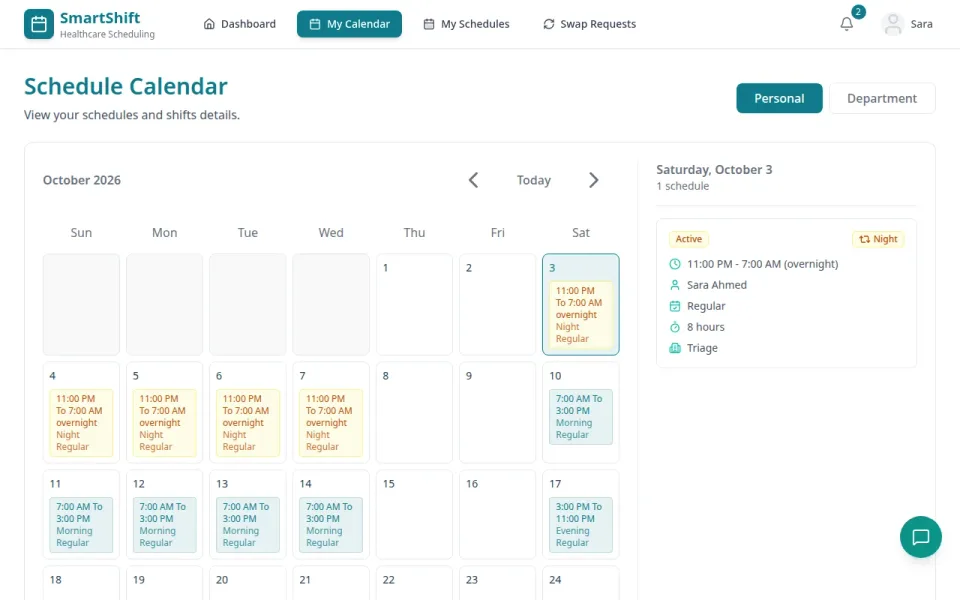
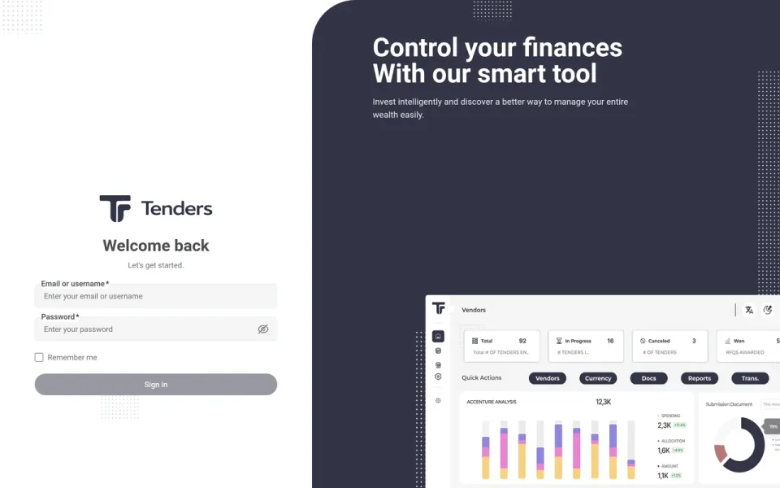
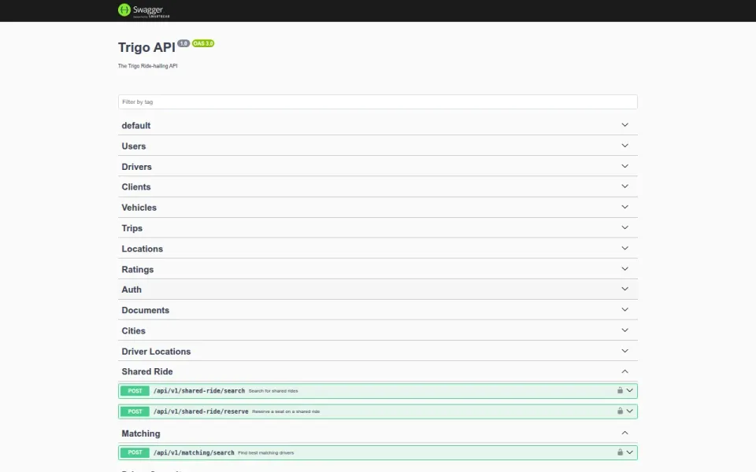
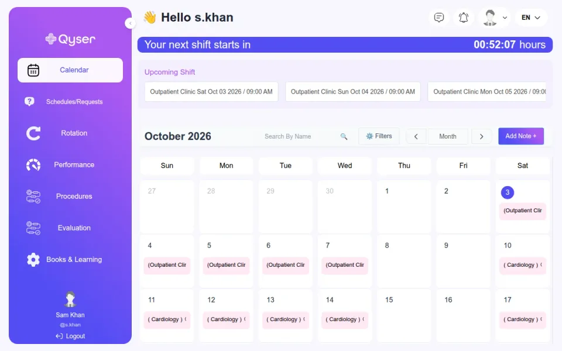

Full-stack engineer with 2+ years building enterprise-grade web platforms — from metadata-driven React UIs to Node.js/NestJS services handling six-figure record aggregations.

**<a href="https://montaser-hub.github.io">Portfolio</a> · <a href="https://www.linkedin.com/in/montaser-ismail/">LinkedIn</a> · <a href="mailto:montaserismail20@gmail.com">Email</a>** · Egypt

## Featured work

<table>
<tr>
<td width="50%" valign="top">

<h3>SmartShift</h3>
Team project · 2025 · Full-stack engineer · API lead

A shift-scheduling platform for hospitals: staff see their schedule, swap shifts through a two-step approval and get live notifications. A Node.js API and a React staff dashboard in one Nx monorepo, with an Angular admin portal.

<b>76 / 102</b> API commits are mine · <b>3 apps</b> API, React, Angular

<a href="https://github.com/montaser-hub/Portal">API & React dashboard</a> · <a href="https://github.com/hageramadan/SmartShift">Angular admin portal</a>

</td>
<td width="50%" valign="top">

<h3>Tenders — Procurement Platform</h3>
Arkaan International · client project · Lead front-end developer · UI designer

A tendering and procurement system. I designed the interface in Figma, then led the React front end, built so that screens are generated from server-side metadata instead of being hand-coded one by one.

<b>566</b> tests passing · <b>49</b> test files

<i>Source private</i>

</td>
</tr>
<tr>
<td width="50%" valign="top">

<h3>Trigo — Ride-Hailing Backend</h3>
Delivery Quote Ltd · team project · Backend developer

The real-time API behind a ride-hailing app: matching riders with drivers, shared rides, live driver locations, and in-app chat and calls.

<b>639</b> unit tests · <b>136</b> documented endpoints · <b>17 / 24</b> commits are mine

<i>Source private</i>

</td>
<td width="50%" valign="top">

<h3>Qyser — Residency Scheduling API</h3>
Qyser Tech · employer, Sep 2024 – Mar 2026 · Backend developer

The backend of a scheduling platform for hospital residency programs: rotations, on-call and clinic shifts, swaps and leave with approvals, performance tracking and reporting, built by a team of five.

<b>~470 / 754</b> commits are mine · <b>168</b> API endpoints · <b>18 months</b> on the product

<i>Source private</i>

</td>
</tr>
</table>

## More projects

- **[Woody — Furniture Store](https://github.com/montaser-hub/Full-Stack-E-commerce-reactjs-nodejs)** — Furniture shop: React front end and Express/MongoDB API. I built auth, the catalogue, the wishlist and the route guards.
- **[Movie App](https://github.com/montaser-hub/movie-website)** — Angular 20 movie app on the TMDB API. I built the account pages, favorites, pagination and English/Arabic switching. · [live demo](https://montaser-hub.github.io/movie-website/search/)
- **[Content Management System](https://github.com/montaser-hub/content-management-system)** — Role-based CMS API: admin-approved signup, JWT cookies with rotating refresh tokens. 23 unit and 6 end-to-end tests.
- **[MealHub — Vanilla JS Shop](https://github.com/montaser-hub/mealhub-ecommerce)** — Food shop with an admin panel, no framework. I built the catalogue, data layer, cart and order management in a team of four. · [live demo](https://montaser-hub.github.io/mealhub-ecommerce/customer/home.html)
- **[Natours — Tour Booking App](https://github.com/montaser-hub/natours)** — Node.js course capstone, extended: closed an admin-signup hole, fixed rating bugs, added Stripe webhooks and reviews.
- **[GraphQL API — Users & Companies](https://github.com/montaser-hub/graphql-api-server)** — Express + Mongoose GraphQL API. DataLoader removes N+1 queries and resolvers read only the fields asked for. Tested.
- **[School Management — Database Design](https://github.com/montaser-hub/school-management-db-design)** — ER model taken through to a tested PostgreSQL schema: 59 tables, 110 foreign keys, constraint tests and sample queries.
- **[Events Blog](https://github.com/montaser-hub/events-blog)** — Community events app with RSVPs, capacity limits and search, rebuilt from a tutorial with CSRF and ownership checks.

**Toolbox** · React · Next.js · Angular · TypeScript · Redux Toolkit · Tailwind CSS · SASS · Framer Motion · Node.js · NestJS · Express · GraphQL · REST APIs · Redis · Message Queues · JWT Auth · MongoDB · Aggregations & Indexing · PostgreSQL · MySQL · SQL Server · AWS S3 · Docker · CI/CD · Nx Monorepos · SOLID Principles · Design Patterns · Jasmine / Supertest · Karma
